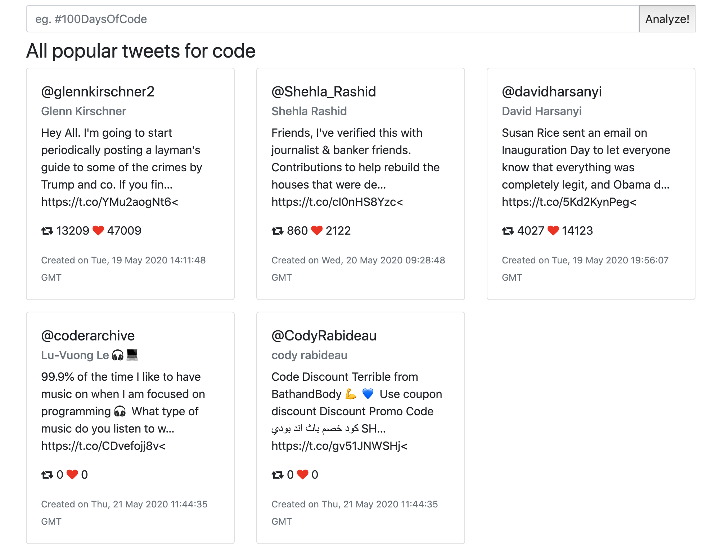

# Workshop: View Tweets using the Twitter API
## Navigation
* [1. Prerequesites](##1.%20Prerequesites)

* [2. Initial set up](##2.%20Initial%20set%20up)

* [3. Installing & Configuring Twit](##3.%20Installing%20&%20Configuring%20Twit)

* [4. Searching for some tweets](##4.%20Searching%20for%20some%20tweets)

* [5. Adding an HTML form to the index.ejs file](##5.%20Adding%20an%20HTML%20form%20to%20the%20index.ejs%20file)

* [6. Configuring our server.js to handle POST requests](##6.%20Configuring%20our%20server.js%20to%20handle%20POST%20requests)

  * [6.1 Installing and configuring `body-parser`](###6.1%20Installing%20and%20configuring%20`body-parser`)

  * [6.2 Adding our POST handler](###6.2%20Adding%20our%20POST%20handler)

  * [6.3 Adjusting the index file to print hashtag variable passed in from the POST handler](###%206.3%20Adjusting%20the%20index%20file%20to%20print%20hashtag%20variable%20passed%20in%20from%20the%20POST%20handler)

  * [6.4 Adjust your GET request](###%206.4%20Adjust%20your%20GET%20request)

* [7. Putting it all together and displaying tweets](##%207.%20Putting%20it%20all%20together%20and%20displaying%20tweets)

  * [7.1 Edit your server.js files POST handler](###%207.1%20Edit%20your%20server.js%20files%20POST%20handler)

  * [7.2 Edit your index.ejs file to handle the Twitter Data](###%207.2%20Edit%20your%20index.ejs%20file%20to%20handle%20the%20Twitter%20Data)

* [8. Summary](##%208.%20Summary)

* [Confused?? We got you! ](##%20Confused??%20We%20got%20you!)

* [##Next steps](##%20Next%20steps)

<!-- toc -->

## 1.Prerequesites 
* Your own Twitter Developers Account (advised)

OR

* Be part of the `FTL Hackathons Team` Twitter Developer Organization -> to become a part of the organization, send us your Twitter handle

## 2. Initial set up
First, we have to install the dependancies of the project: 

``npm install``

Now we can start the server:

``node server.js``

Your server should start at localhost:3000.

Yay! :tada: Now let's try to get some tweets.

## 3. Installing & Configuring Twit
(Adapted from [this tutorial](https://www.codewall.co.uk/how-to-build-a-twitter-hashtag-viewing-tool-tutorial/).)

First up, we need to install the beautiful Twit library which allows us to configure our API credentials and also gives us some pre-defined API functionality. Twit is a neat Twitter API client for Node and saves a boatload of time fleshing out all the code yourself.

Install Twit by running:

```npm install twit```

Then, require the twit library in your server.js file by adding the following code near to the top of the file:


```javascript
const twit = require("twit")
```

Create a `twitterConfig.js` file with the following contents:

```javascript
const twitterConfig = {
        consumer_key: 'your_consumer_key',
        consumer_secret: 'your_consumer_secret',
        access_token: 'your_access_token',
        access_token_secret: 'your_access_token_secret',
}
module.exports = twitterConfig;
```

and require it in `server.js` and put it on the top of the file:
```javascript
const twitterConfig = require("./twitterConfig");
```

Lastly, configure a new Twit instance in `server.js` with your API credentials:

```javascript
let Twitter = new twit({
        consumer_key: twitterConfig.consumer_key,
        consumer_secret: twitterConfig.consumer_secret,
        access_token: twitterConfig.access_token,
        access_token_secret: twitterConfig.access_token_secret,
        timeout_ms: 60 * 1000, // optional HTTP request timeout to apply to all requests.
        strictSSL: true, // optional - requires SSL certificates to be valid.
    });
```
If you don't have credentials, you need to create an app on Twitter Developer first:
1. Navigate to `Apps` on the top right.
2. Click on `Create new app` (top right).
3. Fill out the required fields.
   For *Description* you can write something like:

   > I'm participating in FTL's first virtual Hackathon.
   > We will introduce ourselves to Big Data, COVID-19 and other related datasets, and make sense of them!

   For *Website URL* you can link our website for now(unless you have your own) https://bigdatahack.femaletechleaders.org/

   For *Organization website URL* you can use https://femaletechleaders.org

   For *App usage* you can write something like: 
   > We want to use the API in a hackathon, in order to practice Big Data concepts and to analyze the global effects of Covid-19.

4. Copy & generate `Consumer API keys` and `Access token & access token secret` to your app.

## 4. Searching for some tweets
Before we make it all beautiful and user-friendly, we can test searching for tweets from a hashtag by running the API call and logging the response to the console. For this example, we used the `#stayAtHome` hashtag for the q parameter, which stands for ‘Query’.

Let’s add the code to search tweets on Twitter, just after the Twit instance setup.

```javascript
Twitter.get('search/tweets', {
  q: '#stayAtHome',
  count: 3,
  result_type: "mixed" 
}).catch(function (err) {
  console.log('caught error', err.stack)
}).then(function (result) {
   console.log('data', result.data);
});
```
Now re-run your server.js file and check out the response in the console, and you should be able to see some tweets in the response:


Each tweet comes with a lot of useful data, albeit some of it hidden within the console because they are further objects, but still really handy data. The most obvious pieces of data are the retweet_count and favorite_count.

### So, how do we make this user-friendly and ultimately digestible information?

1. Add a single HTML input field to allow submission of hashtags to the backend.
2. Configuring the server.js file to handle post data from the HTML form and use it within the API call.
3. Return the response to our index file.
4. Parse the data and build our beautiful HTML.
Let’s go…

## 5. Adding an HTML form to the index.ejs file

Starting from line 13, replace 
```html
<p><%- welcomeMessage %></p>
```

with

```html
<div class="container">
    <div class="form mb-2 mt-2">
    <fieldset>
        <form action="/" method="post">
        <div class="input-group">
            <input
            class="form-control"
            name="hashtag"
            placeholder="eg. #stayAtHome"
            required
            type="text"
            />
            <input type="submit" value="Analyze!" />
        </div>
        </form>
    </fieldset>
    </div>
</div>
```

## 6. Configuring our server.js to handle POST requests
### 6.1 Installing and configuring `body-parser`
Now we need to write the logic to handle the posting of input values into the form above. First of all, we need to install some middleware which will give us this functionality, namely body-parser. Body-parser has access to the req and res objects giving us the ability to interrogate what data is passed during the post.

Run the following command to install it:

``npm install body-parser --save``

Then, at the top of your `server.js` file, require it, and lastly, tell the app to utilize its power.

```javascript
const bodyParser = require('body-parser')

app.use(bodyParser.urlencoded({ extended: true }));
```

### 6.2 Adding our POST handler
Add the following JS to your server.js file which will handle a simple posting of the hashtag input form with the name ‘hashtag’.

```javascript
app.post('/', function (req, res) {
  const hashtag = req.body.hashtag  ? req.body.hashtag : null;
  res.render('index',  { hashtag: hashtag })
});
```

### 6.3 Adjusting the index file to print hashtag variable passed in from the POST handler
Add the following EJS markup to your `index.ejs` file, somewhere that you want the hashtag to print out after it’s been submitted to the server and returned as a variable.

```ejs
<% if (locals.hashtag){ %>
    <h3>All popular tweets for <%- hashtag %></h3>
<% } %>
```

### 6.4 Adjust your GET request
Replace the current 
```javascript
app.get('/', function (req, res) {
    res.render('index',  {welcomeMessage: "Welcome to my app."})
    
})
```

with 

```javascript
app.get('/', function (req, res) {
  const hashtag = req.body.hashtag ? req.body.hashtag : null;
  const twitterData = req.body.twitterData ? req.body.twitterData : null;

  res.render('index', { hashtag: hashtag, twitterData: twitterData });
})
```

Now, if you reboot your server, navigate to the index file and submit a new hashtag, you should see the value printed to the page! See below, we submitted the hashtag `bananabread`:


## 7. Putting it all together and displaying tweets
So, we’ve got our Twitter API client ready, the ability to post data from an HTML form, all is left to do is build the logic for the API call to include the hashtag and return data to the index file. Once that’s done, we can format the data to look good and digestible.

The next pieces of code will need to be completely changed if you want to build more functionality into the project, but for now, it’s sole purpose is to handle hashtag inputs and query the Twitter API with them.


### 7.1 Edit your server.js files POST handler
Adjust your Post handler to look the same as below (you can just copy it!), with your own API credentials:

```javascript
app.post('/', function (req, res) {

  if (req.body.hashtag !== null) {

      let Twitter = new twit({
        consumer_key: twitterConfig.consumer_key,
        consumer_secret: twitterConfig.consumer_secret,
        access_token: twitterConfig.access_token,
        access_token_secret: twitterConfig.access_token_secret,
        timeout_ms: 60 * 1000, // optional HTTP request timeout to apply to all requests.
        strictSSL: true, // optional - requires SSL certificates to be valid.
    });

    Twitter.get('search/tweets', {
        q: req.body.hashtag, // use the user posted hashtag value as the query
        count: 5,
        result_type: "mixed" 

    }).catch(function (err) {
        console.log('caught error', err.stack)
        res.render('index', {
            hashtag: null,
            twitterData: null,
            error: err.stack
        });
    }).then(function (result) {
      // Render the index page passing in the hashtag and the Twitter API results
        res.render('index', {
            hashtag: req.body.hashtag, 
            twitterData: result.data,
            error: null
        });
    });
  }
});
```
### 7.2 Edit your index.ejs file to handle the Twitter Data
Adjust your index.ejs file to look similar to below, which does the following:

* Uses font-awesome for like and retweet icons
* Logic to handle if twitter data is present
* JavaScript to build and append HTML to the page

```html
<!DOCTYPE html>
<html>

<head>
    <meta charset="utf-8">
    <title>Twitter Hashtag Viewer</title>
    <link href="https://stackpath.bootstrapcdn.com/bootstrap/4.3.1/css/bootstrap.min.css" rel="stylesheet"
        type="text/css">
    <link href="https://stackpath.bootstrapcdn.com/font-awesome/4.7.0/css/font-awesome.min.css" rel="stylesheet"
        type="text/css">
</head>

<body>
    <div class="container">
        <div class="form mb-2 mt-2"> 
        <fieldset>
            <form action="/" method="post">
                <div class="input-group">
                <input class="form-control" name="hashtag" placeholder="eg. #stayAtHome" required type="text">
                <input type="submit" value="Analyze!">
                </div>
            </form>
        </fieldset>
    </div>   
    

    <div class="container-fluid">

    </div>
      <% if (hashtag !== null){ %>
        <h3>All popular tweets for <%- hashtag %></h3>
      <% } %>

<div id="tweets"></div>

    <% if(twitterData !== null){ %>

    <script>
        let twitterData = <%- JSON.stringify(twitterData) %>;
        let tweetHTML = '<div class="row">';
        for (let index = 0; index < twitterData.statuses.length; index++) {
            var createdDateTime = new Date(twitterData.statuses[index].created_at).toUTCString();

            tweetHTML += '<div class="col-sm-4"><div class="card mb-3">' +
                '<div class="card-body">' +
                '<h5 class="card-title">@' + twitterData.statuses[index].user.screen_name + '</h5>' +
                '<h6 class="card-subtitle mb-2 text-muted">' + twitterData.statuses[index].user.name + '</h6>' +
                '<p class="card-text">' + twitterData.statuses[index].text + '<</p>' +
                '<p class="card-text"><i class="fa fa-retweet" aria-hidden="true"></i> ' + twitterData.statuses[index].retweet_count + ' <i class="fa fa-heart" style="color:red;" aria-hidden="true"></i> ' + twitterData.statuses[index].favorite_count + '</p>' +
                
              //  '<a class="card-link" href="#">Another link</a>' +
                '<p class="card-text"><small class="text-muted">Created on '+createdDateTime.toString()+' </small></p>' +
                '</div>' +
                '</div>' +
                '</div>';
        }
        tweetHTML += '</div>';

        var tweetsContainer = document.getElementById('tweets');
        tweetsContainer.insertAdjacentHTML('beforeend', tweetHTML);
    </script>
    <% } %>

    <script src="https://stackpath.bootstrapcdn.com/bootstrap/4.3.1/js/bootstrap.min.js"></script>
</body>

</html>
```

Save both files and reboot your Node server, navigate to the index page and search for a tweet. You should now have a very clean HTML page with all of the popular and latest tweets for that hashtag, see example below for #code:



## 8. Summary

This tutorial was designed to show you the basics of working with the Twitter API. The API has many uses and whatever your ideas, this tutorial gives you a foundation to set up quickly and analyze tweets from within your own projects.

## Confused?? We got you! 
Here's a repository with the whole setup (server + Twitter API) working:
https://github.com/eharason/twitter-analysis 

## Next steps
Now that you can successfully display tweets on the browser, what else could you do?!

- Ideas:
  - Plot `#stayAtHome` hashtags on a map
  - Compare hash tag sentiments by country
  - Collection of data by a topic you are interested in
  - Create data visualizations and reports

*Feel free to ask the mentors if you have any questions!*

Happy hacking!
